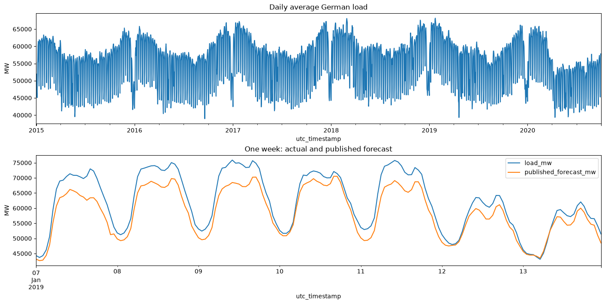
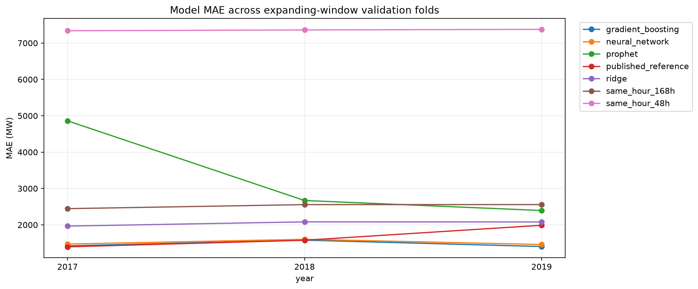
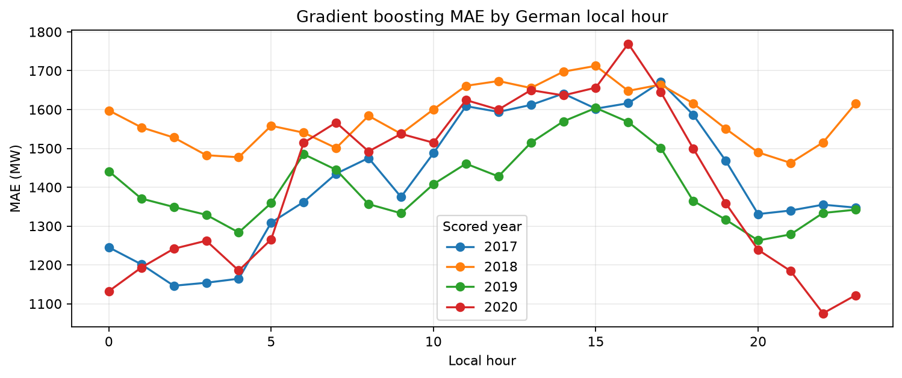
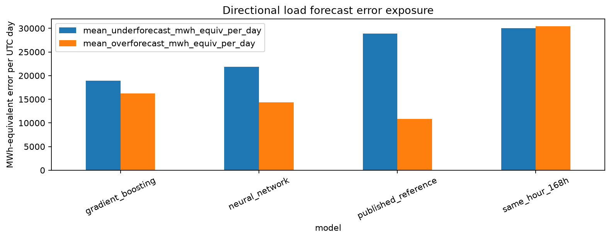

# Germany Electricity Load Forecasting

An applied data science study using the Open Power System Data (OPSD) hourly time series. The project tests whether statistical and machine learning models can improve next-day forecasts of Germany's national electricity demand.

> This is a reproducible portfolio study, not a deployed forecasting service or a measured cost-saving case.

## The study at a glance

| | Definition |
|---|---|
| Forecast target | Germany's actual total electricity load, in MW |
| Forecast horizon | 24 hourly values for the next UTC calendar day |
| Assumed issue cutoff | 12:00 UTC on the previous day; a study assumption, not an operator-confirmed schedule |
| Primary metric | Mean absolute error (MAE), in MW |
| Other metrics | RMSE, signed bias, and high-load MAE |
| Evaluation | Expanding annual folds for 2017, 2018, and 2019 |

## Key results

Gradient boosting had the lowest pooled MAE among the tested candidate models: **1,468.7 MW** across 26,256 hourly predictions. The neural network scored **1,511.4 MW**. The paired day-bootstrap interval for their difference includes zero, so these folds do not establish a clear winner between the two.

The weekly seasonal-naive baseline scored **2,520.2 MW** MAE. The published forecast values in the OPSD export scored **1,654.1 MW**, but their issue and revision times are unavailable. Treat that series as a historical reference, not a verified real-time benchmark.

These results are exploratory. The 2017-2019 folds were reviewed during development, and a 2020 historical period was also viewed. There is no untouched final holdout.

## Visual results

| Actual load and published forecast | Model MAE by validation fold |
|---|---|
|  |  |

| Gradient boosting error by local hour | Directional forecast error exposure |
|---|---|
|  |  |

The figures are generated by the notebook and saved in [`reports/figures/`](reports/figures/). MWh-equivalent error volume is an error summary, not a measure of operating cost or savings.

## What is included

- `notebooks/exploration.ipynb` - exploratory analysis and runnable benchmark sections.
- `scripts/` - data audits, baselines, Prophet and ML backtests, diagnostics, fold comparison, value assessment, and Power BI export.
- `tests/` - checks for the Power BI exporter and model comparison workflow.
- `docs/` - project brief, decision charter, data provenance, feature timing, and evaluation protocol.
- `reports/` - model results, diagnostics, and interpretation.
- `reports/figures/` - PNG figures generated from the notebook and embedded above.
- [`POWER_BI_GUIDE.md`](POWER_BI_GUIDE.md) - instructions for importing the export, creating measures, and building report pages.
- [`docs/medium_article_draft.md`](docs/medium_article_draft.md) - draft article describing the project and its findings.

## Reproduce the analysis

### 1. Set up Python

The analysis was run with Python 3.14.5 and the pinned dependencies in `requirements.txt`. From PowerShell in the repository folder:

```powershell
py -3.14 -m venv .venv
.\.venv\Scripts\Activate.ps1
python -m pip install --upgrade pip
python -m pip install -r requirements.txt
```

### 2. Get the source data

Download the [OPSD 2020-10-06 hourly CSV](https://data.open-power-system-data.org/time_series/2020-10-06/time_series_60min_singleindex.csv) and save it as:

```text
data/raw/time_series_60min_singleindex.csv
```

The source file is about 130 MB and is intentionally excluded from Git. See [data provenance and attribution](docs/data_provenance.md).

### 3. Run the checks and analysis

Run these commands from the repository root after placing the source file:

```powershell
python -m unittest discover -s tests
python scripts/audit_data.py
python scripts/backtest_baselines.py
python scripts/backtest_prophet.py
python scripts/experiment_holidays.py
python scripts/evaluate_holiday_policy.py
python scripts/benchmark_ml.py
python scripts/rolling_validation.py
python scripts/diagnose_rolling_errors.py
python scripts/diagnose_ml_errors.py
python scripts/audit_feature_availability.py
python scripts/compare_models_folds.py
python scripts/assess_forecast_value.py
python scripts/export_powerbi.py
```

The scripts write reports and generated data under `reports/` and `data/processed/`. Generated data is excluded from Git. Some model runs may take several minutes.

## Power BI

Run the final exporter command above, then follow [`POWER_BI_GUIDE.md`](POWER_BI_GUIDE.md). The exported hourly table contains model predictions for the 2017-2019 development folds; model columns are blank outside those periods by design. The repository includes the export workflow and dashboard instructions, but not a `.pbix` report.

## Limitations and interpretation

- The forecast cutoff and UTC-day horizon are assumptions. A German local delivery day can have 23 or 25 hourly periods around daylight-saving changes.
- Source release latency and revisions for actual load have not been verified against the assumed cutoff.
- The OPSD published forecast has no per-value publication or revision timestamp, so it cannot be confirmed as a real-time comparator.
- Realized weather, generation, and prices are not valid day-ahead predictors without archived forecasts available at issue time.
- National load is not a company, utility customer, facility, or mini-grid load profile.
- Forecast errors and MWh-equivalent error volumes are not operating costs or savings.
- The development folds were inspected. Stronger claims require a later chronological holdout fixed before scoring.

## Data source

Open Power System Data (2020), *Time series*, version 2020-10-06, [doi:10.25832/time_series/2020-10-06](https://doi.org/10.25832/time_series/2020-10-06). The primary data source is the ENTSO-E Transparency Platform. The dataset is not included in this repository; consult the source package for its terms and attribution requirements.

## License

Project code and documentation are available under the [MIT License](LICENSE). Third-party data remains subject to its own terms.
